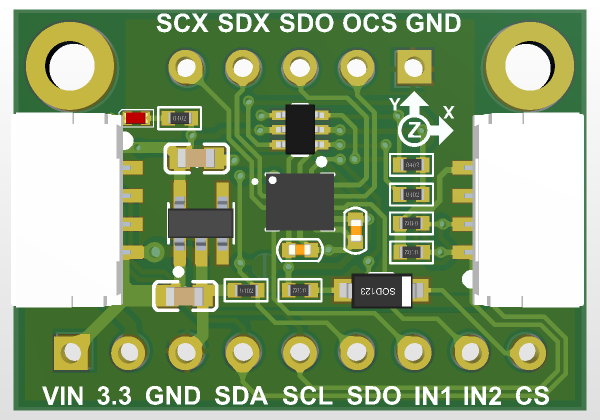
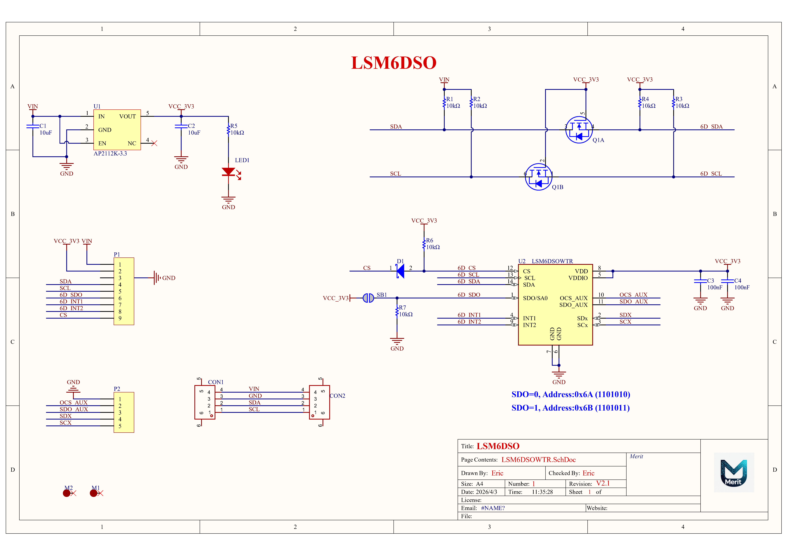
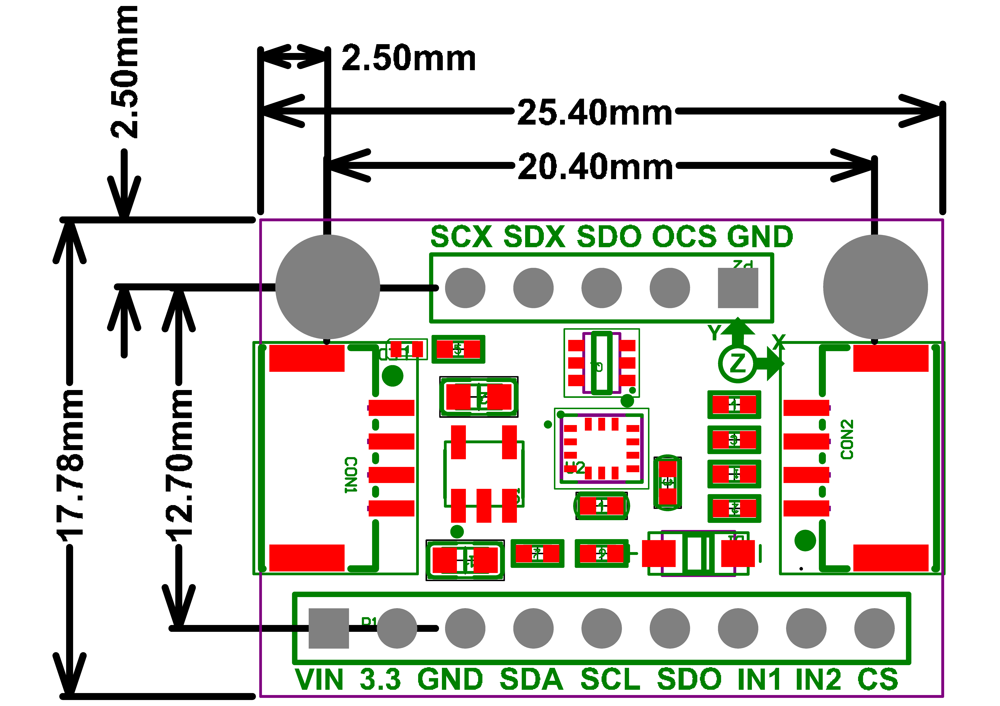

# Introduction

## Overview

The **LSM6DSO-6DoF** is a high-performance 6-axis inertial measurement unit (IMU) module, combining a 3-axis accelerometer and a 3-axis gyroscope in a compact package.  

For interfacing, you can use either **SPI or I2C** - there are two configurable interrupt pins. For advanced usage, you can attach additional devices to an external **I2C/SPI** port - used for optical image stabilization.  

To make getting started fast and easy, we placed the sensors on compact breakout boards with voltage regulation and level-shifted inputs. That way you can use them with **3V or 5V** power/logic devices without worry.

### Datasheet

* [LSM6DSO Datasheet](https://www.st.com/resource/en/datasheet/lsm6dso.pdf)
* [LSM6DSOX Datasheet](https://www.st.com/resource/en/datasheet/lsm6dsox.pdf)

### Schematic

> **The schematic is identical for the LSM6DSOX and LSM6DSO.**  

### Dimensions

> **The dimensions are identical for the LSM6DSOX and LSM6DSO.**  

 

## Features

* **3-axis accelerometer**: ±2/±4/±8/±16 g full-scale range
* **3-axis gyroscope**: ±125/±250/±500/±1000/±2000 dps full-scale range
* **Digital output**: I²C/SPI & MIPI I3C interface
* **Low power consumption**: Ideal for battery-powered applications
* **Compact size**: 25.4mm × 17.8mm x 5.8mm

## Applications

* Motion tracking and gesture detection
* Sensor hub
* Indoor navigation
* IoT and connected devices
* Smart power saving for handheld devices
* EIS and OIS for camera applications
* Vibration monitoring and compensation

## Getting Started

To get started with the LSM6DSO-6DoF module:

1. Connect the module to your microcontroller via I²C or SPI
2. Install the provided driver library
3. Initialize the sensor and start reading data
4. Check the output from serial port

### Test Firmware(Based on STM32F411)

* [LSM6DSOX Test Firmware Download](https://github.com/Eric-Hsia/lsm6dso_test_stm32f411c)

### Test with Arduino(Thanks to Adafruit)

* [Arduino](https://learn.adafruit.com/lsm6dsox-and-ism330dhc-6-dof-imu/arduino)

### Test with CircuitPython(Thanks to Adafruit)

* [CircuitPython](https://learn.adafruit.com/lsm6dsox-and-ism330dhc-6-dof-imu/python-circuitpython)

Refer to the [Specifications](specs.md) for detailed technical parameters.
