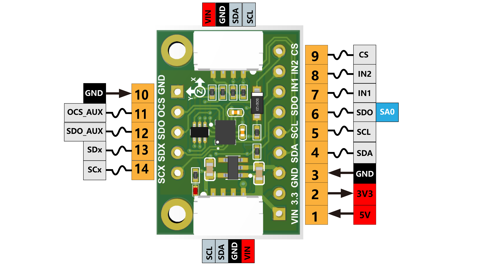

<h1 align="center">LSM6DSOX Specifications</h1>

## Pinout Diagram

## Electrical Characteristics

| Parameter                            | Value      | Unit |
| :------------------------------------:| :----------:| :----:|
| Supply Voltage (VIN)                 | 3-5      | V    |
| Supply Voltage (VDDIO)               | 1.62 - 3.6 | V    |
| Operating Current (High Performance) | 0.55       | mA   |
| Operating Current (Low Power)        | 4          | µA   |
| Temperature Range                    | -40 to +85 | °C   |

## Accelerometer Specifications

| Parameter        | Value                             |
| :----------------:| :---------------------------------:|
| Full-Scale Range | ±2, ±4, ±8, ±16 g                 |
| Sensitivity      | 0.061, 0.122, 0.244, 0.488 mg/LSB |
| Output Data Rate | 1.6 Hz - 6.66 kHz                 |
| Noise Density    | 70 µg/√Hz                         |

## Gyroscope Specifications

| Parameter        | Value                                   |
| ------------------| -----------------------------------------|
| Full-Scale Range | ±125, ±250, ±500, ±1000, ±2000 dps      |
| Sensitivity      | 4.375, 8.75, 17.50, 35.0, 70.0 mdps/LSB |
| Output Data Rate | 12.5 Hz - 6.66 kHz                      |
| Noise Density    | 4.0 mdps/√Hz                            |

## Mechanical Dimensions

- **Package**: LGA-14
- **Dimensions**: 2.5mm × 3.0mm × 0.83mm
- **Weight**: ~10 mg

## Pin Configuration

| Pin |   Name  |                              Function                             |
|:---:|:-------:|:-----------------------------------------------------------------:|
|  1  |   VIN   |                          Power Input, 3-5V                         |
|  2  |   3.3V  |               3.3V output from the voltage regulator              |
|  3  |   GND   |                 common ground for power and logic                 |
|  4  |   SDA   |                            I2C data pin                           |
|  5  |   SCL   |                           I2C clock pin                           |
|  6  |   SDO   |          1. SPI serial data output 2. I2C I2C Address pin         |
|  7  |   IN1   |               Programmable interrupt in I²C and SPI               |
|  8  |   IN2   |                      Programmable interrupt 2                     |
|  9  |    CS   |                      Chip Select pin for SPI                      |
|  10 |   GND   |                 common ground for power and logic                 |
|  11 | OCS_AUX | Pins for advanced users to connect the LSM6DSOX to another sensor |
|  12 | SDO_AUX | Pins for advanced users to connect the LSM6DSOX to another sensor |
|  13 |   SDx   | Pins for advanced users to connect the LSM6DSOX to another sensor |
|  14 |   SCx   | Pins for advanced users to connect the LSM6DSOX to another sensor |

## Communication Interface

### I²C Mode

- **Address**: 0x6A (SDO=GND) or 0x6B (SDO=VDDIO)
- **Speed**: Standard (100 kHz), Fast (400 kHz), Fast+ (1 MHz)

### SPI Mode

- **Mode**: 0 (CPOL=0, CPHA=0) or 3 (CPOL=1, CPHA=1)
- **Speed**: Up to 10 MHz
