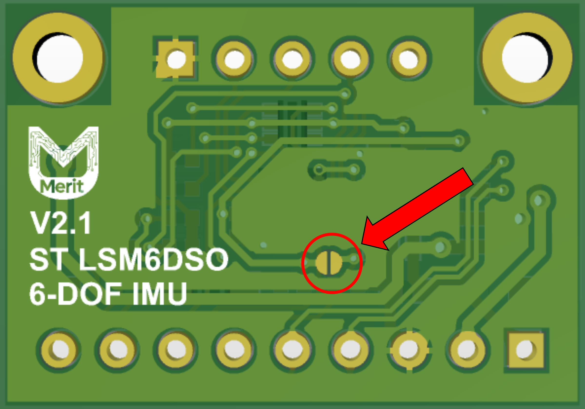

# LSM6DSOX 规格参数

## 引脚图

## 电气特性

| 参数 | 数值 | 单位 |
|:------:|:-----:|:------:|
| 供电电压 (VDD) | 3 - 5 | V |
| 工作电流 (高性能模式) | 0.55 | mA |
| 工作电流 (低功耗模式) | 4 | µA |
| 温度范围 | -40 至 +85 | °C |

## 加速度计规格

| 参数 | 数值 |
|:------:|:------:|
| 全量程范围 | ±2, ±4, ±8, ±16 g |
| 灵敏度 | 0.061, 0.122, 0.244, 0.488 mg/LSB |
| 输出数据速率 | 1.6 Hz - 6.66 kHz |
| 噪声密度 | 70 µg/√Hz |

## 陀螺仪规格

| 参数 | 数值 |
|:------:|:------:|
| 全量程范围 | ±125, ±250, ±500, ±1000, ±2000 dps |
| 灵敏度 | 4.375, 8.75, 17.50, 35.0, 70.0 mdps/LSB |
| 输出数据速率 | 12.5 Hz - 6.66 kHz |
| 噪声密度 | 4.0 mdps/√Hz |

## 引脚配置

| 引脚 |   名称  |                              功能描述                             |
|:---:|:-------:|:-----------------------------------------------------------------:|
|  1  |   VIN   |                          Power Input, 3-5V                         |
|  2  |   3.3V  |               3.3V output from the voltage regulator              |
|  3  |   GND   |                 common ground for power and logic                 |
|  4  |   SDA   |                            I2C data pin                           |
|  5  |   SCL   |                           I2C clock pin                           |
|  6  |   SDO   |          1. SPI serial data output 2. I2C I2C Address pin         |
|  7  |   IN1   |               Programmable interrupt in I²C and SPI               |
|  8  |   IN2   |                      Programmable interrupt 2                     |
|  9  |    CS   |                      Chip Select pin for SPI                      |
|  10 |   GND   |                 common ground for power and logic                 |
|  11 | OCS_AUX | Pins for advanced users to connect the LSM6DSOX to another sensor |
|  12 | SDO_AUX | Pins for advanced users to connect the LSM6DSOX to another sensor |
|  13 |   SDx   | Pins for advanced users to connect the LSM6DSOX to another sensor |
|  14 |   SCx   | Pins for advanced users to connect the LSM6DSOX to another sensor |

## 通信接口

### I²C 模式（默认）

- **地址**：0x6A (SDO=GND) 或 0x6B (SDO=VDDIO, pad soldered)
- **速度**：标准模式 (100 kHz)、快速模式 (400 kHz)

> **I2C 地址设置**：默认情况下，SDO引脚连接到GND，设备地址为0x6A。将SDO引脚连接到VDDIO（焊盘焊接）会将设备地址更改为0x6B。这允许在同一I2C总线上使用两个LSM6DSOX设备。

### SPI 模式

- **模式**：0 或 3
- **速度**：最高 10 MHz
