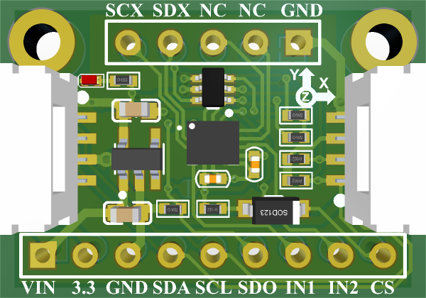

merit-lsm6dso-6DoF
===================

:link_to_translation: ../en/index.rst

概述
----

**merit-lsm6dso-6DoF** 是一款高性能开发板，专为快速原型验证而设计。
板载强劲的 MCU、Wi-Fi/蓝牙模块及丰富的外设接口，帮助您快速启动项目。

   merit-lsm6dso-6DoF — 正面图

规格一览
--------

.. list-table::
   :widths: 30 70
   :header-rows: 1

   * - 参数
     - 值
   * - 主控芯片
     - 待定
   * - Flash
     - 4 MB
   * - PSRAM
     - 2 MB
   * - USB 接口
     - USB Type-C（供电 + 数据）
   * - 尺寸
     - 55 × 28 mm
  
  
.. toctree::
   :maxdepth: 2

  用户指南<user_guide>
